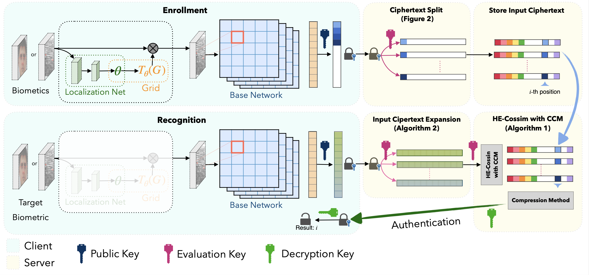

# blind-match
## Blind-Match: Efficient Homomorphic Encryption-Based 1:N Matching for Privacy-Preserving Biometric Identification


## 1. Server Setting
- In this test, there are five servers are used.
  - A client, a main server, and three cluster servers.
  
- [Note] If you're not in a situation where you're going to have five servers, please prepare two servers: A client and a cluster (Use cluster1).

- We use NAVER Cloud servers (https://www.ncloud.com/product/compute/server)
  - All server specs are Standard-g2 Server.
  - CentOS 7.8.64
  - Two cores (Intel(R) Xeon(R) Gold 5220 CPU @ 2.20GHz) with 8GB DRAM

## 2. Installation
### Requirements
- OS: Linux
- Python: 3.9 or higher version
  - aiohttp==3.8.4
  - Flask==2.2.3
  - numpy==1.24.2
  - onnx==1.15.0
  - onnxruntime==1.16.3
  - triton==2.1.0
- Go: go1.21 or higher version
  - Lattigo V5 library (https://github.com/tuneinsight/lattigo)

## 3. Setting
### 3.1 Prepare Dataset
(1) Fingerprint Datasets
- PolyU Cross Sensor Fingerprint Database (PolyU)
  - It can be obtained by contacting the Hong Kong Polytechnic University.

- FVC(Fingerprint Verification Competition) Datasets
  - We use three versions (2000, 2002, 2004) of the FVC datasets in this experiment.
  - Each dataset can be obtained by the homepage of the Fingerprint Verification Competition.
  - FVC 2000 can be obtained on the website: http://bias.csr.unibo.it/fvc2000/download.asp
  - FVC 2002 can be obtained on the website: http://bias.csr.unibo.it/fvc2002/download.asp
  - FVC 2004 can be obtained on the website: http://bias.csr.unibo.it/fvc2004/download.asp

- CASIA V5 Datasets
  - It can be obtained by contacting the website of the Institute of Automation Chinese Academy of Sciences: http://english.ia.cas.cn/db/201611/t20161101_169922.html


(2) Face Datasets
### TBD

###  3.2 Data Preprocessing
We provide the preprocessed fingerprint dataset (FVC 2002 DB1).

### 3.3 Model Training
- We use ResNet-18-based CNN architecture for feature vector extraction.
- Detailed guide is in the ```training``` directory.

### 3.4 Generate Key and Ciphertext Database
- To simulate our code, it is needed the key pair in each cluster. And ciphertext database in each cluster's storage.
- The detailed manual of generating the key pair and ciphertext database is in the ```setup``` directory.

### 3.5. Client Setting
- The Client requests the HE-based biometric match to the server.
- It extracts the feature vector from the biometric image, encrypts it, and sends the ciphertext to the main server using HTTP POST API.
- After receiving the HTTP response from the main server, then the client decrypts the result ciphertext in the body of the response and obtains the ID of the image.
- The detailed manual of the client's usage is in the ```client``` directory.

### 3.6 Main Server Setting
- The main server has the role of the main node in the cluster architecture.
- When receive the HTTP POST API from the client, then send it each cluster and combine the responses of clusters. And send it to the client as a response to the client's HTTP request.
- Fix the port number, each cluster's URL, and run this server.
- The detailed manual of the main server's usage is in the ```main``` directory.

### 3.7 Cluster Server Setting
- Each cluster server has the role of cluster node in the cluster architecture.
- When receiving the HTTP POST API from the main server, and each cluster conducts the Input Ciphertext Expansion (Algorithm 2) and HE-Cossim with CCM (Algorithm 1) which are introduced in our paper.
- Set up the key path and ciphertext database path, and fix the port number.
- Run each cluster server.
- The detailed manual of the each cluster's usage is in the ```cluster1``` directory.

## 4. Run codes
- Run the Main server and three cluster servers.
- Run the Client code.

### How to use
See README.md files in each directory for guides.
